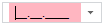
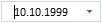

# Combo.getMaskEdit

Combo.getMaskEdit
-

# Combo.getMaskEdit

## Синтаксис

getMaskEdit();

## Описание

Метод getMaskEdit возвращает редактор ввода данных, соответствующих определенному шаблону.

## Комментарии

Метод используется вместе со свойствами [Combo.UseMask](Combo.UseMask.htm) и [Combo.EnableEdit](Combo.EnableEdit.htm).

## Пример

Для выполнения примера подключите ссылки на библиотеку PP.js и таблицы визуальных стилей PP.css. Разместим на html-странице компонент [Combo](../../Components/Combo/Combo.htm) и установим для него редактор маски для ввода даты.

После выполнения примера в строке ввода будет установлен редактор для ввода даты:

Если значение введено корректно (соответствует регулярному выражению), то исчезает цветовой индикатор некорректного ввода:

См. также:

[Combo](Combo.htm)

		Справочная
		 система на версию 10.9
		 от 18/08/2025,
		 © ООО «ФОРСАЙТ»,
