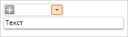
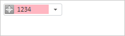
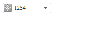
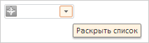
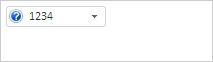

# Combo.getTextBox

Combo.getTextBox
-

# Combo.getTextBox

## Синтаксис

getTextBox();

## Описание

Метод getTextBox возвращает
 текстовое поле редактора ввода.

## Комментарии

Возвращаемое значение является объектом класса [PP.Ui.TextBox](../TextBox/TextBox.htm).

## Пример

Для выполнения примера необходимо наличие в теге <head> html-страницы
 ссылок на файлы сценария PP.js и файл стилей PP.css, в теге <body>
 html-страницы элемента 
 с идентификатором «combo», а сам пример
 нужно разместить в теге <script>. В событии onload тега <body>
 необходимо указать вызов функции createCombo(). Добавляем на страницу
 редактор ввода с раскрывающейся панелью и реализуем обработчик события
 [ValueChanged](Combo.ValueChanged.htm):

var combo;
function createCombo() {
    // Создаем редактор ввода с раскрывающейся панелью
    combo = new PP.Ui.Combo({
        // Устанавливаем родительский элемент
        ParentNode: document.getElementById("combo"),
        // Устанавливаем ширину
        Width: 100,
        // Устанавливаем признак создания редакторов
        NoCreateEditors: false,
        /* Устанавливаем отображение подсказки при наведении курсора мыши
        на кнопку открытия раскрывающейся панели */
        IsHint: true,
        /* Устанавливаем возможность открытия раскрывающейся панели
        по нажатию на заголовок */
        OpenOnContentClick: true,
        /* Устанавливаем возможность открытия раскрывающейся панели
        по нажатию на пиктограмму компонента */
        OpenOnIconClick: true,
        /* Устанавливаем возможность закрытия раскрывающейся панели
        по нажатию на содержимое компонента */
        CloseOnContentClick: true,
        // Устанавливаем пиктограмму в левой стороне компонента
        IconPosition: PP.LTRB.Left,
        /* Устанавливаем признак независимости ширины раскрывающейся панели
        от ширины редактора ввода */
        IsDropHasCombosWidth: false,
        // Обрабатываем событие изменения значения в редакторе ввода
        ValueChanged: function(sender, args) {
            console.log("Изменено значение в редакторе ввода");
        },
    });
    // Помещаем текст в раскрывающуюся панель
    var panel = combo.getDropPanel();
    panel.setContent("Текст");
    // Устанавливаем ширину раскрывающейся панели
    panel.setWidth(200);
}
Нажимаем левой кнопкой мыши на редактор ввода. Для свойства OpenOnContentClick
 установлено значение true, поэтому
 откроется раскрывающаяся панель. Раскрывающаяся панель будет шире редактора
 ввода, так как для свойства IsDropHasCombosWidth установлено значение
 false:

Получаем размеры пиктограммы, установленной в редакторе ввода:

// Получаем размеры пиктограммы, установленной в редакторе ввода
console.log("Высота пиктограммы: " + combo.getIconHeight());
console.log("Ширина пиктограммы: " + combo.getIconWidth());
В результате в консоль будет выведено:

Высота пиктограммы: 16

Ширина пиктограммы: 16

Устанавливаем значение в текстовое поле редактора ввода и возможность
 редактирования содержимого редактора ввода:

// Устанавливаем текст в редактор ввода
combo.getTextBox().setContent("Значение");
//Устанавливаем возможность редактирования текстового поля редактора ввода
combo.setEnableEdit(true);
Нажимаем кнопкой мыши на пиктограмму редактора ввода. Для свойств OpenOnIconClick и CloseOnContentClick
 установлено значение true, поэтому
 раскрывающаяся панель закроется:

В консоль будет выведено:

Произошло нажатие на пиктограмму в редакторе ввода

Нажимаем 2 раза кнопкой мыши на редактор ввода и меняем содержимое на
 «Значение 1». В результате в консоль будет выведено:

Изменено значение в редакторе ввода

Устанавливаем разрешенные к вводу символы в текстовое поле редактора
 ввода и подсветку некорректно введенного значения:

// Очищаем редактор ввода
combo.setContent("");
// Устанавливаем разрешенные к вводу символы в текстовое поле редактора ввода
var textBox = combo.getTextBox();
textBox.setAllowedSymbols(['1', '2', '3', '4']);
// Устанавливаем подсветку некорректно введенного значения
combo.applyNotValidCSS();
Вводим текст «12345» в редактор ввода. В результате текстовое поле редактора
 ввода будет иметь подсветку некорректно введенного значения, а также содержать
 следующий текст: «1234»:

Устанавливаем подсветку корректно введенного значения:

// Очищаем редактор ввода
combo.setContent("");
//  Устанавливаем подсветку корректно введенного значения
combo.applyValidCSS();
Вводим текст «12345» в редактор ввода. В результате текстовое поле редактора
 ввода будет иметь подсветку корректно введенного значения, а также содержать
 следующий текст: «1234»:

Наведем курсор мыши на кнопку открытия раскрывающейся панели. В результате
 появится подсказка, так как для свойства IsHint
 установлено значение true:

Меняем пиктограмму редактора ввода:

// Меняем пиктограмму редактора ввода
var iconImageList = new PP.ImageList({
        //источник спрайта
        Source: "../build/img/app/help.png",
        //размер картинок в спрайте
        IconHeight: 16,
        IconWidth: 16,
    });
combo.setIconImageList(iconImageList);
В результате будет изменена пиктограмма редактора ввода:

См. также:

[Combo](Combo.htm)

		Справочная
		 система на версию 10.9
		 от 18/08/2025,
		 © ООО «ФОРСАЙТ»,
