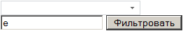
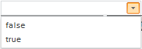

# ComboBox.filterByText

ComboBox.filterByText
-

# ComboBox.filterByText

## Синтаксис

filterByText (value);

## Параметры

value. Строка фильтрации.

## Описание

Метод filterByText осуществляет фильтрацию элементов по строке.

## Комментарии

Метод актуален, если для свойства [ComboBox.AutoFind](ComboBox.AutoFind.htm) установлено значение false.

## Пример

Для выполнения примера подключите библиотеки PP.js и таблицы визуальных стилей PP.js. Создайте поле для ввода текста с идентификатором «Text1» и кнопку с надписью «Фильтровать», при нажатии на которую будет выполняться функция Filter().

<!--Компонент ComboBox-->

<input type="text" id="Text1" /><!--Текстовое поле-->

<input type="button" id="Button2" value="Фильтровать" onclick="Filter();" /><!--Кнопка

для вызова функции фильтрации-->

После выполнения примера на html-странице будут размещены компонент [ComboBox](../../Components/ComboBox/ComboBox.htm), кнопка с надписью «Фильтровать» и поле для ввода текста. Введите в текстовое поле английскую букву «e», нажмите кнопку «Фильтровать»:

Затем раскройте список элементов. В списке элементов будет выведено два значения: «false» и «true»:

См. также:

[ComboBox](ComboBox.htm)

		Справочная
		 система на версию 10.9
		 от 18/08/2025,
		 © ООО «ФОРСАЙТ»,
