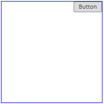
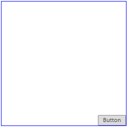

# Control.Anchors

Control.Anchors
-

# Control.Anchors

## Синтаксис

Anchors;

## Описание

Свойство Anchors определяет
 позицию компонента, размещённого внутри контейнера.

## Комментарии

Свойство возвращает массив объектов типа [AnchorStyles](dhtmlCommon.chm::/Enums/AnchorStyles.htm).

Свойство актуально только для элементов управления, размещенных внутри
 компонентов-наследников класса [PP.Ui.Container](../Container/Container.htm).

## Пример

Для выполнения примера необходимо наличие на HTML-странице ссылок на
 файлы PP.css, PP.js и jquery.js. Добавим на страницу компонент Panel
 с [кнопкой](../../Components/ToolBarButton/ToolBarButton.htm),
 находящейся в нажатом состоянии, создадим для панели границу:

      //Создаем компонент Panel
     var panel = new PP.Ui.Panel({
        Width: 200,
        Height: 200,
        ParentNode: document.body
     });
      //Добавляем границу для панели
     panel.addClass("newBorder");
     $("div.newBorder").css("border", "1px solid blue");
      //Создаем кнопку, которая будет размещаться в верхнем правом углу панели
     but = new PP.Ui.ToolBarButton({
        Content: "Button",
        Anchors: ["Top", "Right"],
        IsToggleButton: true
     });
      //Добавляем кнопку на панель
     panel.add(but);

На странице будет размещена панель с кнопкой в верхнем правом углу:

Изменим размеры панели и положение кнопки:

 //В свойстве Tag устанавливаем JSON-объект с размерами панели
 but.getParent().setTag({
     Width: 250,
     Height: 250
 });
 //Устанавливаем размеры панели
 but.getParent().setSettings(but.getParent().getTag());
 //возвращаем JSON-объект с текущей позицией кнопки
 flags = but.getAnchorFlags();
 flags.Bottom = true;
 flags.Top = false;
 //Обновляем позицию кнопки
 but.updatePosition();

После выполнения примера панель будет иметь следующий вид:

См. также:

[Control](Control.htm)

		Справочная
		 система на версию 10.9
		 от 18/08/2025,
		 © ООО «ФОРСАЙТ»,
