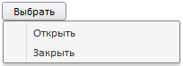

# Control.ContextMenu

Control.ContextMenu
-

# Control.ContextMenu

## Синтаксис

ContextMenu: [PP.Ui.Menu](../Menu/Menu.htm);

## Описание

Свойство ContextMenu определяет
 контекстное меню для компонента.

## Пример

Для выполнения примера подключите к HTML-странице ссылки на библиотеку
 PP.js и таблицу визуальных стилей PP.css. Далее приведен javascript-код,
 при помощи которого на HTML-странице будет размещена [кнопка](../../Components/Button/Button.htm).

После выполнения примера на HTML-странице будет размещена кнопка с надписью
 «Выбрать». При нажатии на кнопку правой кнопкой мыши будет вызвано контекстное
 меню, имеющее следующий вид:

См. также:

[Control](Control.htm)

		Справочная
		 система на версию 10.9
		 от 18/08/2025,
		 © ООО «ФОРСАЙТ»,
