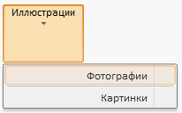

# Control.IsRTL

Control.IsRTL
-

# Control.IsRTL

## Синтаксис

IsRTL: Boolean;

## Описание

Свойство IsRTL определяет признак
 расположения элементов компонента по правому краю.

## Комментарии

Допустимые значения:

	- true. Элементы компонента
	 располагаются по правому краю;

	- false. По умолчанию.
	 Элементы компонента располагаются по левому краю.

## Пример

Для выполнения примера подключите ссылки на библиотеку PP.js и таблицы
 визуальных стилей PP.css. Создадим кнопку ленты приложения - экземпляр
 класса [RibbonButton](dhtmlRibbon.chm::/Classes/ribbonbutton/ribbonbutton.htm).
 Кнопка должна содержать раскрывающееся меню:

После выполнения примера на HTML-странице будет размещён компонент [RibbonButton](dhtmlRibbon.chm::/components/ribbonbutton/ribbonbutton.htm).
 При нажатии на кнопку раскрывается меню. Компоненты меню расположены по
 правому краю:

См. также:

[Control](Control.htm)

		Справочная
		 система на версию 10.9
		 от 18/08/2025,
		 © ООО «ФОРСАЙТ»,
