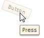

# Control.Opacity

Control.Opacity
-

# Control.Opacity

## Синтаксис

Opacity: Integer;

## Описание

Свойство Opacity определяет
 прозрачность компонента.

## Комментарии

Для свойства устанавливается значение в диапазоне от 0 до 1, где 0 -
 абсолютно прозрачный, 1 - абсолютно непрозрачный.

## Пример

Для выполнения примера в теге <head> HTML-страницы добавьте ссылки
 на файлы PP.js и PP.css. Добавим на страницу кнопку и определим для нее
 прозрачность 50 %, угол поворота и всплывающую подсказку:

 button = new PP.Ui.Button({
    ParentNode: document.body,
    Content: "Button",
    Opacity: 0.5,
    Rotate: 20,
    ShowToolTip: true,
    ToolTip: "Press"
 });

После выполнения примера на страницу будет добавлена кнопка, для которой
 настроена прозрачность, всплывающая подсказка и угол поворота 20 градусов:

См. также:

[Control](Control.htm)

		Справочная
		 система на версию 10.9
		 от 18/08/2025,
		 © ООО «ФОРСАЙТ»,
