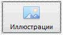

# Control.setFocus

Control.setFocus
-

# Control.setFocus

## Синтаксис

setFocus();

## Описание

Метод setFocus устанавливает
 фокус компонента.

## Пример

Для выполнения примера добавьте ссылки на библиотеку PP.js и таблицы
 визуальных стилей PP.css. Предполагается наличие изображения с наименованием
 «ImgBtn1.png». Создадим кнопку - экземпляр класса [Button](../Button/Button.htm).
 Для этой кнопки установим фокус:

После выполнения примера на HTML-странице будет размещен компонент [Button](../../Components/Button/Button.htm),
 имеющий следующий вид:

См. также:

[Control](Control.htm)

		Справочная
		 система на версию 10.9
		 от 18/08/2025,
		 © ООО «ФОРСАЙТ»,
