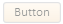
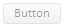

# Control.setIsHovered

Control.setIsHovered
-

# Control.setIsHovered

## Синтаксис

setIsHovered(value: Boolean);

## Параметры

value. Признак отображения
 компонента только при наведении на него курсора.

## Описание

Метод setIsHovered настраивает
 отображение компонента только при наведении на него курсора.

## Комментарии

Допустимые значения параметра value:

	- true. Компонент отображается
	 только при наведении на него курсора. Если курсор не наведён на компонент,
	 то компонент скрывается;

	- false. Компонент отображается
	 стандартным образом.

## Пример

Для выполнения примера подключите библиотеку PP.js и таблицы визуальных
 стилей PP.css. Создадим [кнопку](../../Components/Button/Button.htm)
 и отобразим ее как при наведении на нее курсора. Применим для кнопки прозрачность
 50%:

  b1 = new PP.Ui.Button({
    ParentNode: document.body,
    Content: "Button"
  });
  //Переводим кнопку в состояние Hovered
  b1.setIsHovered(true);
  //Применяем прозрачность
  b1.setOpacity(0.5);

После выполнения примера на странице была размещена кнопка, имеющая
 следующий вид:

Удалим стиль для состояния Hovered:

b1.removeStateClasses();

Кнопка будет выглядеть следующим образом:

См. также:

[Control](Control.htm)

		Справочная
		 система на версию 10.9
		 от 18/08/2025,
		 © ООО «ФОРСАЙТ»,
