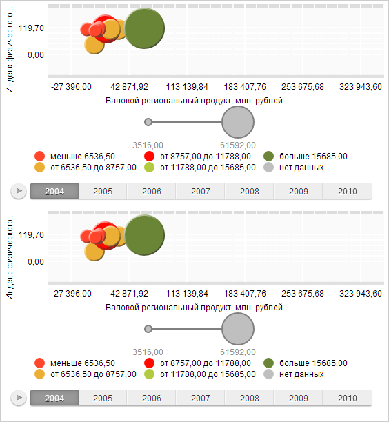

# DVSyncManager.add

DVSyncManager.add
-

# DVSyncManager.add

## Синтаксис

add(visualizer: [PP.Ui.DataVisualizer](../DataVisualizer/DataVisualizer.htm));

## Параметры

visualizer. Визуализатор.

## Описание

Метод add добавляет визуализатор
 в коллекцию синхронизируемых элементов.

## Пример

Для выполнения примера необходимо наличие на html-странице компонента
 [BubbleChart](dhtmlBubbleChart.chm::/Components/BubbleChart/BubbleChart.htm)
 с наименованием «bubbleChart» (см. «[Пример
 создания компонента BubbleChart](dhtmlBubbleChart.chm::/Components/BubbleChart/BubbleChart_Example.htm)»). Также необходимо
 создать копию файла BubbleChartSettings.js, в котором необходимо изменить
 название переменной настроек «settings» на «settings2». В файле
 компонента нужно добавить ссылку на созданный файл.

Изменим высоту текущей пузырьковой диаграммы и создадим новую пузырьковую
 диаграмму. Определим настройки синхронизации и установим объекты, которые
 необходимо синхронизировать:

// Изменяем высоту текущей пузырьковой диаграммы
bubbleChart.setHeight(300);
// Получаем DOM-элемент контейнера, в котором будет нарисована вторая пузырьковая диаграмма
var container = document.getElementById("bubbleChart");
// Создаем пузырьковую диаграммю
var bubbleChart2 = new PP.Ui.BubbleChart();
bubbleChart2.setSettings(settings2);
// Размещаем пузырьковую диаграмму в контейнере
bubbleChart2.addToNode(container);
// Задаем размеры пузырьковой диаграммы
bubbleChart2.setWidth(551);
bubbleChart2.setHeight(300);
// Определяем объект синхронизации компонентов
var syncSettings = {
    SyncHover: true, // Синхронизация подсветки
    SyncSelection: true, // Синхронизация выделения
    SyncTimeline: true, // Синхронизация временной шкалы
    HoverSameTime: false // Синхронизация элементов с разными шагами временной шкалы
}
var syncManager = new PP.Ui.DVSyncManager(syncSettings);
// Добавляем синхронизируемые компоненты
syncManager.add(bubbleChart);
syncManager.add(bubbleChart2);
В результате будет изменена высота текущей пузырьковой диаграммы и добавлена
 новая пузырьковая диаграмма. Данные пузырьковой диаграммы будут синхронизированы:

Удалим параметры синхронизации:

// Удаляем синхронизируемый объект
syncManager.remove(bubbleChart);
// Удаляем все синхронизируемые объекты, если они имеются
if (syncManager.getVisualizers() != null)
    syncManager.clear();
В результате пузырьковая диаграмма не будет синхронизироваться.

[DVSyncManager](DVSyncManager.htm)

		Справочная
		 система на версию 10.9
		 от 18/08/2025,
		 © ООО «ФОРСАЙТ»,
