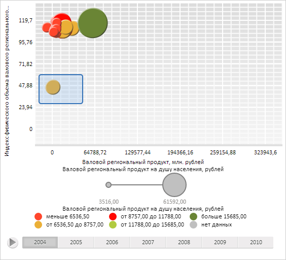

# DataVisualizer.AreaSelection

DataVisualizer.AreaSelection
-

**

# DataVisualizer.AreaSelection

## Синтаксис

AreaSelection: PP.Ui.AreaSelection

## Описание

Свойство AreaSelection**
 устанавливает область выделения для диаграмм.

## Комментарии

Значение свойства устанавливается из JSON и с помощью метода setAreaSelection,
 а возвращается - с помощью метода getAreaSelection.

По умолчанию свойство содержит значение null.

## Пример

Для выполнения примера необходимо наличие на html-странице компонента
 [BubbleChart](dhtmlBubbleChart.chm::/Components/BubbleChart/BubbleChart.htm)
 с наименованием «bubbleChart» (см. «[Пример
 создания компонента BubbleChart](dhtmlBubbleChart.chm::/Components/BubbleChart/BubbleChart_Example.htm)»). Создадим в пузырьковой диаграмме область выделения
 указанного размера и отобразим её, а также обработаем события [AreaSelected](DataVisualizer.AreaSelected.htm)
 и [AreaSelecting](DataVisualizer.AreaSelecting.htm):

// Получим выделенную область пузырьковой диаграммы
var areaSelection = bubbleChart.getAreaSelection();
// Зададим позицию области выделения
areaSelection.setLeft(70);
areaSelection.setTop(140);
// Зададим ширину и высоту области выделения
areaSelection.setWidth(88);
areaSelection.setHeight(59);
// Установим область выделения
bubbleChart.setAreaSelection(areaSelection);
// Отобразим область выделения
areaSelection.show();
console.log("Пузырьки в области выделения:")
// Получим элементы пузырьковой диаграммы в области выделения
var items = bubbleChart.getItemsByAreaRect(areaSelection);
for (var item in items) {
    console.log(item);
};
// Обработаем событие AreaSelected
bubbleChart.AreaSelected.add(function (sender, args) {
    console.log("Заданная область выделена");
});
// Обработаем событие AreaSelecting
bubbleChart.AreaSelecting.add(function (sender, args) {
    console.log("Выделение области пузырьковой диаграммы...");
});

В результате выполнения примера в пузырьковой диаграмме была создана область выделения
 шириной, равной 88 пикселям, и высотой, равной 59 пикселям:

В консоли браузера были выведены сведения о пузырьке, входящем в область
 выделения:

Пузырьки в области выделения:

Serie0_Point0

Теперь удалим созданную область выделения:

bubbleChart.clearAreaSelection();

В результате выполнения данной строки сценария выделение в пузырьковой диаграмме было
 очищено:

Далее вручную выделим произвольную область в пузырьковой диаграмме. В процессе и по
 завершении данного выделения в консоли браузера в результате срабатывания
 событий [AreaSelecting](DataVisualizer.AreaSelecting.htm) и
 [AreaSelected](DataVisualizer.AreaSelected.htm) будут выведены
 соответствующие сообщения:

Выделение области пузырьковой диаграммы...

Заданная область выделена

См. также:

[DataVisualizer](DataVisualizer.htm)

		Справочная
		 система на версию 10.9
		 от 18/08/2025,
		 © ООО «ФОРСАЙТ»,
