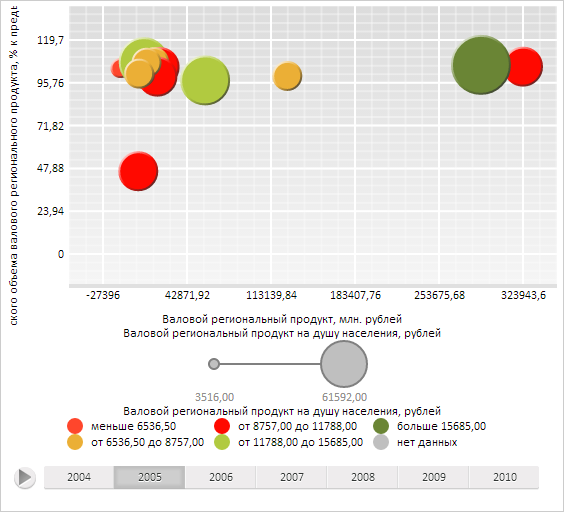

# DataVisualizer.TimelineStep

DataVisualizer.TimelineStep
-

**

# DataVisualizer.TimelineStep

## Синтаксис

TimelineStep: function (sender, args: Object);

## Параметры

sender. Источник события;

args. Информация о событии.
 Доступный аргумент: TickIndex - индекс текущего шага временной шкалы.

## Описание

Событие TimelineStep**
 генерируется при изменении текущего шага временной шкалы диаграммы.

## Пример

Для выполнения примера необходимо наличие на html-странице компонента
 [BubbleChart](dhtmlBubbleChart.chm::/Components/BubbleChart/BubbleChart.htm)
 с наименованием «bubbleChart» (см. «[Пример
 создания компонента BubbleChart](dhtmlBubbleChart.chm::/Components/BubbleChart/BubbleChart_Example.htm)»). Обработаем событие TimelineStep
 и отобразим в пузырьковой диаграмме данные следующего года:

// Обработаем событие TimelineStep
bubbleChart.TimelineStep.add(function (sender, args) {
        console.log("Индекс текущего шага временной шкалы: " + args.TickIndex);
        // Обновим данные из источника
        bubbleChart.updateData(bubbleChart.getTimeline() ? args.TickIndex : 0);
    });
// Получим временную шкалу
var timeline = bubbleChart.getTimeline();
// Изменим текущий шаг временной шкалы, увеличив его на единицу
timeline.setCurrentStep(timeline.getCurrentStep() + 1);

В результате выполнения примера в пузырьковой диаграмме были загружены данные следующего
 года:

При вызове обработчика события TimelineStep
 в консоли браузера был выведен текущий шаг временной шкалы:

Индекс текущего шага временной шкалы: 1

См. также:

[DataVisualizer](DataVisualizer.htm)

		Справочная
		 система на версию 10.9
		 от 18/08/2025,
		 © ООО «ФОРСАЙТ»,
