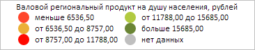
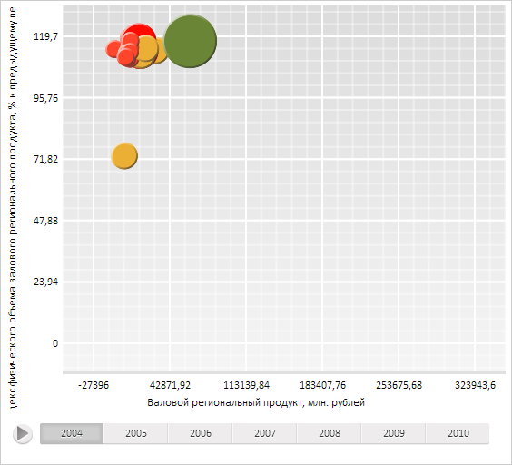
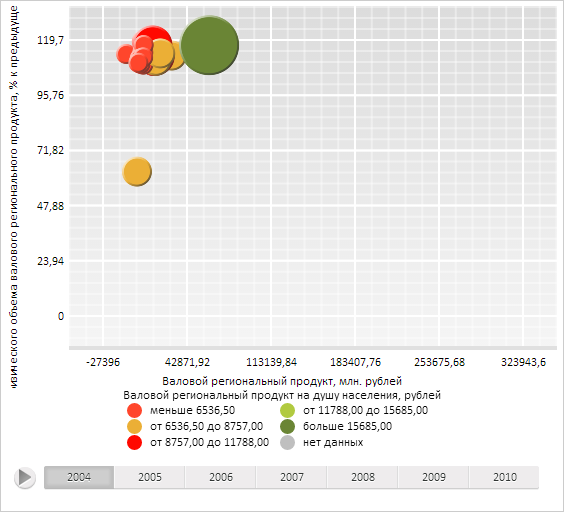

# DataVisualizer.UseLegendsPacking

DataVisualizer.UseLegendsPacking
-

**

# DataVisualizer.UseLegendsPacking

## Синтаксис

UseLegendsPacking: Boolean

## Описание

Свойство UseLegendsPacking**
 разрешает и запрещает использование упаковки легенд диаграммы.

## Комментарии

Значение свойства устанавливается из JSON и с помощью метода setUseLegendsPacking,
 а возвращается с помощью метода getUseLegendsPacking.

Свойство содержит значение true,
 если использования упаковки легенд для диаграммы разрешено, и false
 (значение по умолчанию) - если запрещено.

## Пример

Для выполнения примера необходимо наличие на html-странице компонента
 [BubbleChart](dhtmlBubbleChart.chm::/Components/BubbleChart/BubbleChart.htm)
 с наименованием «bubbleChart» (см. «[Пример
 создания компонента BubbleChart](dhtmlBubbleChart.chm::/Components/BubbleChart/BubbleChart_Example.htm)»). Разрешим использование
 упаковки легенд на диаграмме и для первой легенды установим размещение
 элементов в две колонки, а также обработаем событие [LegendHeaderClicked](DataVisualizer.LegendHeaderClicked.htm):

// Пока не будем перерисовывать пузырьковую диаграмму
bubbleChart.beginUpdate();
// Разрешим использование упаковки легенд на диаграмме
bubbleChart.setUseLegendsPacking(true);
// Получим первую легенду пузырьковой диаграммы
var firstLegend = bubbleChart.getFirstLegend();
// Разместим элементы легенды пузырьковой диаграммы в две колонки
firstLegend.setColumnCount(2);
// Обновим визуализатор данных
bubbleChart.refresh();
// Обработаем событие LegendHeaderClicked
bubbleChart.LegendHeaderClicked.add(function (sender, args) {
        console.log("Тип диаграммы: " + args.Type);
    });

После выполнения примера ничего не изменилось, поскольку мы включили
 режим обновления данных, запрещающий перерисовку компонента до выхода
 из этого режима. Теперь выйдем из него, выполнив следующую строку кода:

bubbleChart.endUpdate();

В результате элементы первой легенды пузырьковой диаграммы были расположены
 в две колонки:

При нажатии на заголовок данной легенды в результате обработки события
 [LegendHeaderClicked](DataVisualizer.LegendHeaderClicked.htm)
 в консоли браузера был выведен её тип:

Тип диаграммы: Intervals

Теперь скроем все легенды пузырьковой диаграммы:

bubbleChart.setLegendsPackingMaxPart(0);

После выполнения данной строки сценария были скрыты все легенды:

Далее отобразим только легенду, описывающую цвет пузырьков пузырьковой
 диаграммы:

// Отобразим только легенду, описывающую цвет пузырьков пузырьковой диаграммы
bubbleChart.setLegendsPackingMaxPart(0.2);
// Обновим всю пузырьковую диаграмму
bubbleChart.refresh();

Таким образом, в пузырьковой диаграмме будет отображена только одна
 легенда:

Чтобы отобразить все легенды пузырьковой диаграммы, нужно в качестве
 параметра метода setLegendsPackingMaxPart указать значение от 0,3 и выше.

См. также:

[DataVisualizer](DataVisualizer.htm)

		Справочная
		 система на версию 10.9
		 от 18/08/2025,
		 © ООО «ФОРСАЙТ»,
