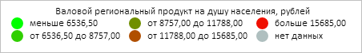

# DataVisualizer.Visuals

DataVisualizer.Visuals
-

**

# DataVisualizer.Visuals

## Синтаксис

Visuals: Object

## Описание

Свойство Visuals** устанавливает
 и возвращает настройки сопоставления значений рядов данных осям диаграммы,
 цвету и размеру её элементов.

## Комментарии

Значение свойства устанавливается из JSON и с помощью метода setVisuals,
 а возвращается с помощью метода getVisuals.

Свойство содержит JSON-объект со следующими полями типа PP.CoordinateVisual:
 X, Y, R и Color.

## Пример

Для выполнения примера необходимо наличие на html-странице компонента
 [BubbleChart](dhtmlBubbleChart.chm::/Components/BubbleChart/BubbleChart.htm)
 с наименованием «bubbleChart» (см. «[Пример
 создания компонента BubbleChart](dhtmlBubbleChart.chm::/Components/BubbleChart/BubbleChart_Example.htm)»). Изменим массив цветов для шкалы
 сопоставления данных пузырьковой диаграммы:

// Определим шкалу цветов
var colorScale = new PP.ScaleBase({
    Items: "#00ff00 #30cf00 #708f00 #b04f00 #f00f00",
    NoData: "#AFBFBF",
    TypeArguments: "Brush"
});
// Получим настройки сопоставления данных
var visuals = bubbleChart.getVisuals();
// Получим набор цветов шкалы пузырьковой диаграммы
var colorItems = visuals.Color.getColorMapping().getScale().getItems();
// Поменяем цвета шкалы
for (var i in colorItems) {
    colorItems[i].setColor(colorScale.getItems()[i].getColor());
};
// Установим настройки сопоставления данных
bubbleChart.setVisuals(visuals);
// Обновим пузырьковую диаграмму
bubbleChart.refresh();

В результате выполнения примера были изменены цвета пузырьков в шкале
 сопоставления данных пузырьковой диаграммы:

См. также:

[DataVisualizer](DataVisualizer.htm)

		Справочная
		 система на версию 10.9
		 от 18/08/2025,
		 © ООО «ФОРСАЙТ»,
