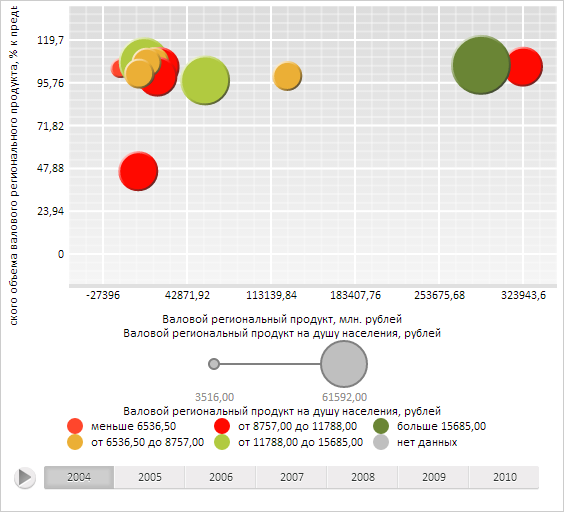

# DataVisualizer.draw

DataVisualizer.draw
-

**

# DataVisualizer.draw

## Синтаксис

draw(year: Number, noAnimation: Boolean);

## Параметры

year. Индекс года, за который
 необходимо отрисовать данные;

noAnimation. Признак отсутствия
 воспроизведения анимации. Если параметра равен значению true,
 то анимация в диаграмме не будет воспроизводиться, иначе будет (по умолчанию).

## Описание

Метод draw** полностью
 перерисовывает диаграмму.

## Пример

Для выполнения примера необходимо наличие на html-странице компонента
 [BubbleChart](dhtmlBubbleChart.chm::/Components/BubbleChart/BubbleChart.htm)
 с наименованием «bubbleChart» (см. «[Пример
 создания компонента BubbleChart](dhtmlBubbleChart.chm::/Components/BubbleChart/BubbleChart_Example.htm)»). Отобразим в пузырьковой диаграмме данные следующего
 года:

// Получим временную шкалу
var timeline = bubbleChart.getTimeline();
// Отрисуем данные за следующий год
bubbleChart.draw(timeline.getCurrentStep() + 1);

В результате выполнения примера в пузырьковой диаграмме были отображены данные следующего
 года:

См. также:

[DataVisualizer](DataVisualizer.htm)

		Справочная
		 система на версию 10.9
		 от 18/08/2025,
		 © ООО «ФОРСАЙТ»,
