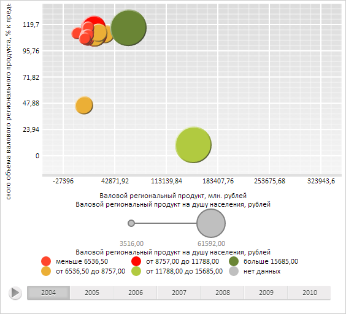

# DataVisualizer.loadData

DataVisualizer.loadData
-

**

# DataVisualizer.loadData

## Синтаксис

loadData(data: Object);

## Параметры

data. Загружаемые данные.

## Описание

Метод loadData** дозагружает
 в диаграмму указанные данные.

## Комментарии

В качестве параметра указываются данные в виде JSON-объекта следующего
 вида: {<идентификатор источника данных>: <объект настроек источника
 данных>}.

## Пример

Для выполнения примера необходимо наличие на html-странице компонента
 [BubbleChart](dhtmlBubbleChart.chm::/Components/BubbleChart/BubbleChart.htm)
 с наименованием «bubbleChart» (см. «[Пример
 создания компонента BubbleChart](dhtmlBubbleChart.chm::/Components/BubbleChart/BubbleChart_Example.htm)»). Определим новые данные для ряда
 с индексом 1:

// Определим новые данные для ряда с индексом 1
var dataSource = {
    "ds0": {
        "LoadedIndexes": [0, 1, 2, 3, 4, 5, 6],
        "Series": {
            "Serie1_Point0": {
                // Данные по оси X
                "DimX": {
                    "Items": ["150000", "160000", "170000", "180000", "190000", "200000", "NULL"]
                },
                // Данные по оси Y
                "DimY": {
                    "Items": ["10", "11", "12", "13", "14", "15", "16"]
                },
                // Данные, отображающиеся на размер пузырьков пузырьковой диаграммы
                "DimR": {
                    "Items": ["50000", "51000", "52000", "53000", "54000", "55000", "56000"]
                },
                // Данные, отображающиеся на цвет пузырьков пузырьковой диаграммы
                "DimCol": {
                    "Items": ["12000", "12500", "13500", "14000", "14500", "15000", "15500"]
                }
            }
        }
    }
}
// Загрузим дополнительные данные
bubbleChart.loadData(dataSource);
// Заново отрисуем пузырьковую диаграмму
bubbleChart.draw()

В результате выполнения примера для ряда с индексом 1 были определены
 новые данные, в связи с чем изменился внешний вид пузырьковой диаграммы:

См. также:

[DataVisualizer](DataVisualizer.htm)

		Справочная
		 система на версию 10.9
		 от 18/08/2025,
		 © ООО «ФОРСАЙТ»,
