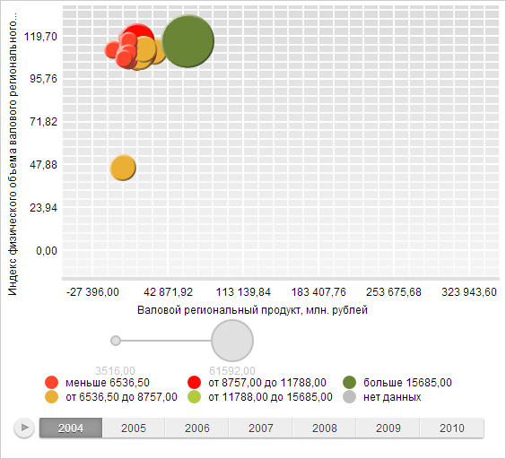

# DataVisualizerContainer.addElement

DataVisualizerContainer.addElement
-

# DataVisualizerContainer.addElement

## Синтаксис

addElement(elem: [PP.Ui.PlacedControlBase](dhtmlGraphicBase.chm::/Classes/PlacedControlBase/PlacedControlBase.htm));

## Параметры

elem. Добавляемый визуальный
 элемент.

## Описание

Метод addElement добавляет
 визуальный элемент в контейнер.

## Пример

Для выполнения примера необходимо наличие на html-странице компонента
 [BubbleChart](dhtmlBubbleChart.chm::/Components/BubbleChart/BubbleChart.htm)
 с наименованием «bubbleChart» (см. «[Пример
 создания компонента BubbleChart](dhtmlBubbleChart.chm::/Components/BubbleChart/BubbleChart_Example.htm)»).

Создадим контейнер визуальных элементов, в который добавим легенду пузырьковой диаграммы
 и установим отступы контейнера. Изменим прозрачность элемента контейнера.
 Также в консоль среды разработки выведем следующие параметры контейнера:

	- Размеры контейнера элементов;

	- Выравнивания контейнера;

	- Общие размеры контейнера;

	- Признак, определяющий, будет ли контейнер автоматически уменьшать
	 рабочую область;

	- Количество элементов в контейнере.

// Создаем контейнер визуальных элементов
var settings = {
    HorizontalAlignment: PP.HorizontalAlignment.Center,
    VerticalAlignment: PP.VerticalAlignment.Bottom
}
var container = new PP.Ui.DataVisualizerContainer(settings);
// Получаем легенду пузырьковой диаграммы
var legend = bubbleChart.getLegendById("1_BubbleChart71");
// Добавляем легенду в контейнер
container.addElement(legend);
// Устанавливаем отступы контейнера
container.setLeft(100);
container.setTop(350);
// Выводим размеры контейнера визуальных элементов
console.log("Ширина контейнера элементов: " + container.getWidth());
console.log("Высота контейнера элементов: " + container.getHeight());
// Выводим типы выравниваний контейнера по вертикали и горизонтали
console.log("Вертикальное выравнивание контейнера элементов: " + container.getVerticalAlignment());
console.log("Горизонтальное выравнивание контейнера элементов: " + container.getHorizontalAlignment());
// Выводим общие размеры контейнера элементов
console.log("Общая ширина контейнера элементов: " + container.getRealWidth());
console.log("Общая высота контейнера элементов: " + container.getRealHeight());
// Выводим признак того, что контейнер не уменьшает свою рабочую область
console.log("Признак, определяющий, будет ли контейнер автоматически уменьшать рабочую область: " + container.getIsOverlap());
// Выводим количество элементов в контейнере
console.log("Количество элементов в контейнере: " + container.getLength());
// Изменяем прозрачность элемента контейнера
container.getElements()[0].setOpacity(0.5);
В результате выполнения примера будет изменено положение и значение
 прозрачности легенды пузырьковой диаграммы:

Также в консоли среды разработки будут выведены параметры контейнера
 визуальных элементов:

Ширина контейнера элементов: 166

Высота контейнера элементов: 65

Вертикальное выравнивание контейнера элементов:
 Bottom

Горизонтальное выравнивание контейнера элементов:
 Center

Общая ширина контейнера элементов: 166

Общая высота контейнера элементов: 65

Признак, определяющий, будет ли контейнер автоматически
 уменьшать рабочую область: false

Количество элементов в контейнере: 1

[DataVisualizerContainer](DataVisualizerContainer.htm)

		Справочная
		 система на версию 10.9
		 от 18/08/2025,
		 © ООО «ФОРСАЙТ»,
