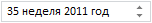
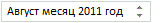
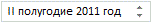
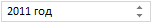

# DateTimeEdit.Mode

DateTimeEdit.Mode
-

# DateTimeEdit.Mode

## Синтаксис

Mode: [PP.Ui.MonthCalendarMode](../../Enums/MonthCalendarMode.htm);

## Описание

Свойство Mode устанавливает
 режим отображения даты и времени.

## Комментарии

Значением свойства являются элементы перечисления [MonthCalendarMode](../../Enums/MonthCalendarMode.htm).
 По умолчанию установлено значение 0.

## Пример

Для выполнения примера подключите ссылки на библиотеку PP.js и таблицы визуальных стилей PP.css. Далее приведен javascript-код, при помощи которого на html-странице размещается компонент [DateTimeEdit](../../Components/DateTimeEdit/DateTimeEdit.htm):

После выполнения примера на html-странице будет размещен компонент [DateTimeEdit](../../Components/DateTimeEdit/DateTimeEdit.htm), имеющий следующий вид:

В редакторе отображается порядковый номер недели, которая включает в себя установленную дату, и год, поскольку для свойства Mode установлено значение 1.

Месяц и год отображаются при Mode: 2:

Квартал и год отображаются при Mode: 3:

Полугодие и год отображаются при Mode: 4:

Год отображается при Mode: 5:

При установке значения 0 отображаются день, месяц и год, как показано на странице «[Пример создания компонента DateTimeEdit](../../Components/DateTimeEdit/Example_DateTimeEdit.htm)».

См. также:

[DateTimeEdit](DateTimeEdit.htm)

		Справочная
		 система на версию 10.9
		 от 18/08/2025,
		 © ООО «ФОРСАЙТ»,
