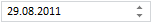

# DateTimeEdit.ShowTime

DateTimeEdit.ShowTime
-

# DateTimeEdit.ShowTime

## Синтаксис

ShowTime: Boolean

## Описание

Свойство ShowTime определяет, отображается ли время в компоненте.

## Комментарии

По умолчанию установлено значение true, то есть в поле ввода редактора отображается время.

Свойство актуально, если для свойства [DateTimeEdit.Mode](DateTimeEdit.Mode.htm) установлено значение по умолчанию (0).

## Пример

Для выполнения примера подключите ссылки на библиотеку PP.js и таблицы визуальных стилей PP.css. Далее приведен javascript-код, при помощи которого на html-странице размещается компонент [DateTimeEdit](../../Components/DateTimeEdit/DateTimeEdit.htm), в поле ввода которого отображается только дата:

После выполнения примера будет создан редактор даты и времени, в поле ввода которого не будет отображаться значение времени:

См. также:

[DateTimeEdit](DateTimeEdit.htm)

		Справочная
		 система на версию 10.9
		 от 18/08/2025,
		 © ООО «ФОРСАЙТ»,
