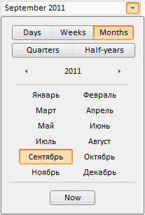

# DateTimePicker.Mode

DateTimePicker.Mode
-

# DateTimePicker.Mode

## Синтаксис

Mode: [PP.Ui.MonthCalendarMode](../../Enums/MonthCalendarMode.htm);

## Описание

Свойство Mode возвращает режим
 отображения календаря и поля ввода компонента.

## Комментарии

Значением свойства являются элементы перечисления [MonthCalendarMode](../../Enums/MonthCalendarMode.htm).

## Пример

Для выполнения примера создайте компонент [DateTimePicker](../../Components/DateTimePicker/DateTimePicker.htm)
 (см. «[Пример
 создания компонента DateTimePicker](../../Components/DateTimePicker/Example_DateTimePicker.htm)») с наименованием «DTP». Для того
 чтобы дата в компоненте отображалась в режиме месяцев для свойства Mode
 установим значение 2:

DTP.setMode(2);

После выполнения примера редактор даты и времени будет отображаться
 в режиме месяцев. Поле ввода и календарь выбора даты будут выглядеть следующим
 образом:

См. также:

[DateTimePicker](DateTimePicker.htm)

		Справочная
		 система на версию 10.9
		 от 18/08/2025,
		 © ООО «ФОРСАЙТ»,
