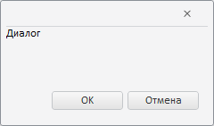

# Конструктор Dialog

Конструктор Dialog
-

# Конструктор Dialog

## Синтаксис

PP.Ui.Dialog(settings);

## Параметры

settings. JSON-объект со значениями
 свойств компонента.

## Описание

Конструктор Dialog создает экземпляр
 класса [Dialog](Dialog.htm).

## Пример

Для выполнения примера подключите ссылки на библиотеку PP.js и визуальные
 стили PP.css. На html-странице должен содержаться элемент div с идентификатором
 «but». Далее приведен javascript-код, при помощи которого создается кнопка,
 при нажатии на которую раскрывается диалог:

После выполнения примера при нажатии на кнопку «Open dialog», будет
 открыт следующий диалог:

См. также:

[Dialog](Dialog.htm)

		Справочная
		 система на версию 10.9
		 от 18/08/2025,
		 © ООО «ФОРСАЙТ»,
