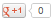
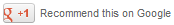

# DiscussMenu.appendGPlusLink

DiscussMenu.appendGPlusLink
-

# DiscussMenu.appendGPlusLink

## Синтаксис

appendGPlusLink(url)

## Параметры

url. URL текущей страницы. Параметр задан по умолчанию.

## Описание

Метод appendGPlusLink размещает ссылку на plusone.js на странице.

## Пример

Для выполнения примера предполагается наличие на странице компонента [DiscussMenu](../../Components/DiscussMenu/DiscussMenu.htm) с наименованием «shareMenu» (см. «[Пример создания компонента DiscussMenu](../../Components/DiscussMenu/Example_DiscussMenu.htm)»). В теге BODY добавьте элемент DIV с наименованием «Div1». В DOM-вершину с идентификатором «Div1» добавим кнопку Google+1:

    shareMenu.appendGPlusLink();//размещаем ссылку на plusone.js
    shareMenu.appendPluseoneContent(document.getElementById("Div1"));//размещаем кнопку в указанной DOM-вершине
    var but3 = new PP.Ui.Button(//кнопка для изменения параметров кнопки Google+1
    {
        Content: "Изменить кнопку",
        ParentNode: document.getElementById("btn3"),
        Click: function ()
        {
            shareMenu.goPlusone(
            {
                container: document.getElementById("Div1"),
                pluseone: {
                    size: "medium",
                    annotation: "inline",
                    width: "300"
                }
            })
        }
    });

После выполнения примера на странице будут размещены кнопки Google+1 и «Изменить кнопку». Кнопка Google+1 с начальными настройками:

При нажатии на «Изменить кнопку», изменятся размер кнопки и вид подписи:

Примечание. Доступные параметры кнопки описаны на [developers.google.com](https://developers.google.com/%2b/plugins/%2b1button/).

См. также:

[DiscussMenu](DiscussMenu.htm)

		Справочная
		 система на версию 10.9
		 от 18/08/2025,
		 © ООО «ФОРСАЙТ»,
