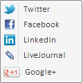
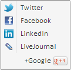

# DiscussMenu.getGooglePlusItem

DiscussMenu.getGooglePlusItem
-

# DiscussMenu.getGooglePlusItem

## Синтаксис

getGooglePlusItem ()

## Описание

Метод getGooglePlusItem возвращает пункт меню «Google+».

## Комментарии

Чтобы отобразить пункт меню Google+, из [конструктора DiscussMenu](Constructor_DiscussMenu.htm) для свойства GooglePlusItem нужно установить JSON-объект со значением true для свойства [Visible](../MenuItem/MenuItem.Visible.htm).

## Пример

Для выполнения примера подключите ссылки на библиотеки PP.js и PP.Metabase.js, визуальные стили PP.css и PP.Metabase, файл ресурсов resources.ru.js. В теге BODY добавьте элементы DIV с идентификаторами «btn1» и «check1». В тег SCRIPT добавьте следующий код:

PP.setCurrentCulture(PP.setCurrentCulture(PP.Cultures.ru))//текущая культура
var shareMenu = new PP.Ui.DiscussMenu(
{
    ImagePath: "PP_img/",
    GooglePlusItem: {//отображается пункт Google+
        Visible: true
    }
});
var btn = new PP.Ui.Button(//кнопка для вызова меню
{
    ParentNode: document.getElementById("btn1"),
    Content: "Обсудить",
    Menu: shareMenu
})
var check = new PP.Ui.CheckBox(//флажок, при установке которого пункт Google+ будет отображаться справа налево
{
    ParentNode: document.getElementById("check1"),
    Content: "isRTL GooglePlus",
    CheckedChanged: function (sender, args)
    {
        if (check.getCheckedState() == true)
        {
            shareMenu.getGooglePlusItem().setIsRTL(true)
        }
        else
        {
            shareMenu.getGooglePlusItem().setIsRTL(false)
        }
    }
})

После выполнения примера на странице будут размещены кнопка «Обсудить» и флажок «isRTL GooglePlus». При нажатии на кнопку «Обсудить» будет раскрытом меню с пунктом «GooglePlus»:

При установке флажка «isRTL GooglePlus» пункт Google+ будет отображаться справа налево:

См. также:

[DiscussMenu](DiscussMenu.htm)

		Справочная
		 система на версию 10.9
		 от 18/08/2025,
		 © ООО «ФОРСАЙТ»,
