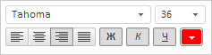
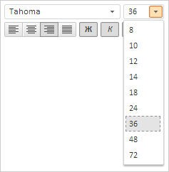

# Конструктор FontBox

Конструктор FontBox
-

# Конструктор FontBox

## Синтаксис

PP.Ui.FontBox (settings)

## Параметры

settings. JSON-объект со значениями
 свойств компонента.

## Описание

Конструктор FontBox создает
 экземпляр класса [FontBox](FontBox.htm).

## Пример

Для выполнения примера необходимо наличие в теге <head> html-страницы
 ссылок на файлы сценария PP.js, файл стилей PP.css и файл с ресурсами
 (например, resources.ru.js), в теге <body> html-страницы элемента
 
 с идентификатором «fontBox», а сам пример нужно разместить
 в теге <script>. В событии onload тега <body> необходимо указать
 вызов функции createFontBox(). Добавляем на страницу компонент для настройки
 параметров текста и реализуем обработчики событий [PropertyChanged](FontBox.PropertyChanged.htm)
 и [ValueChanged](FontBox.ValueChanged.htm):

function createFontBox() {
    // Устанавливаем корневой каталог с ресурсами
    PP.resourceManager.setRootResourcesFolder("../build/resources");
    // Определяем текущую культуру
    PP.setCurrentCulture(PP.Cultures.ru);
    // Создаем обработчик события изменения параметров текста
    function onPropertyChanged(sender, args) {
            console.log({
                PropertyName: args.PropertyName,
                Font: args.Font,
                Alignment: args.Alignment
            });
        }
        // Создаем обработчик события изменения значения компонента
    function onValueChanged(sender, args) {
            console.log({
                PropertyName: args.PropertyName,
                Value: args.Value,
                Font: args.Font
            });
        }
        // Создаем компонент для настройки параметров текста
    textSettings = new PP.Ui.FontBox({
        // Устанавливаем источник изображений
        ImagePath: "../build/img/",
        // Устанавливаем родительский элемент
        ParentNode: document.getElementById("fontBox"),
        // Устанавливаем параметры шрифта
        Font: {
            FontFamily: "Tahoma",
            Size: 36,
            Color: "#FF0000",
            IsBold: true,
            IsItalic: true,
            IsUnderline: true
        },
        // Устанавливаем отображение размера текста больше 36
        IsSizeExtend: true,
        // Обрабатываем событие изменения значения компонента
        ValueChanged: PP.Delegate(onValueChanged),
        // Выравниваем по правому краю
        Alignment: PP.HorizontalAlignment.Right,
        // Устанавливаем обработчик события изменения параметров текста
        PropertyChanged: PP.Delegate(onPropertyChanged)
    });
}

В результате выполнения примера на html-странице будет размещен компонент
 FontBox со следующими настройками:

Нажимаем кнопкой мыши на раскрывающееся меню с размерами шрифта. В списке
 будут размеры больше 36:

 

Выбираем размер текста 24. В результате в консоль будет выведена информация
 об изменениях:

Object {PropertyName: "Size", Font: PP.Font,
 Alignment: "Right"}

Object {PropertyName: "Size", Value: 24,
 Font: PP.Font}

См. также:

[FontBox](FontBox.htm)

		Справочная
		 система на версию 10.9
		 от 18/08/2025,
		 © ООО «ФОРСАЙТ»,
