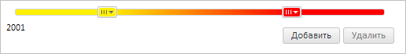

# GradientSlider.getColorByValue

GradientSlider.getColorByValue
-

**

# GradientSlider.getColorByValue

## Синтаксис

getColorByValue(value);

## Параметры

*value. Значение*
 [бегунка с возможностью
 выбора цвета](../SliderItemColor/SliderItemColor.htm).

## Описание

Метод getColorByValue**
 возвращает цвет [бегунка
 с возможностью выбора цвета](../SliderItemColor/SliderItemColor.htm) по указанному значению.

## Комментарии

Метод возвращает значение типа [PP.Color](dhtmlCommon.chm::/Classes/PP/Color/Color.htm).

## Пример

Для выполнения примера предполагается наличие на странице компонента
 [GradientSlider](../../Components/GradientSlider/GradientSlider.htm)
 с наименованием «slider» (см. «[Пример
 создания компонента GradientSlider](../../Components/GradientSlider/Example_GradientSlider.htm)» ). Получим и выведем цвет [бегунка](../SliderItemColor/SliderItemColor.htm)
 со значением 0.75, обработаем события [AddClick](GradientSlider.AddClick.htm),
 [ItemColorChanged](GradientSlider.ItemColorChanged.htm), [RemoveClick](GradientSlider.RemoveClick.htm), изменим цвет
 [бегунка](../SliderItemColor/SliderItemColor.htm) с индексом
 0:

// Получим цвет бегунка со значением 0.75
var color = slider.getColorByValue(0.75);
// Выведем полученное значение цвета
console.log("Цвет полученного бегунка: R:" + color.getR() + " G:" + color.getR() + " B:" + color.getB());
// Обработаем событие AddClick
slider.AddClick.add(function (sender, args, timeout) {
    console.log("Инициировано событие AddClick")
});
// Обработаем событие ItemColorChanged
slider.ItemColorChanged.add(function (sender, args, timeout) {
    console.log("Инициировано событие ItemColorChanged")
});
// Обработаем событие RemoveClick
slider.RemoveClick.add(function (sender, args, timeout) {
    console.log("Инициировано событие RemoveClick")
});
// Изменим цвет бегунка с индексом 0
slider.getItemByIndex(0).setColor("#FFF000");

Нажмем поочередно на кнопки «Добавить» и «Удалить». Будет добавлен и
 удален [бегунок](../SliderItem/SliderItem.htm) компонента.

В результате выполнения примера был изменен цвет [бегунка](../SliderItemColor/SliderItemColor.htm)
 с индексом 0:

Также в консоли бразуера было выведено значение цвета бегунка с заданным
 значением и сообщения о вызове обработанных событий:

Цвет полученного бегунка: R:255 G:255 B:0

Инициировано событие ItemColorChanged

Инициировано событие AddClick

Инициировано событие RemoveClick

См. также:

[ GradientSlider](GradientSlider.htm)

		Справочная
		 система на версию 10.9
		 от 18/08/2025,
		 © ООО «ФОРСАЙТ»,
