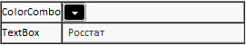

# GridPanel.getTable

GridPanel.getTable
-

# GridPanel.getTable

## Синтаксис

getTable ();

## Описание

Метод getTable возвращает html-таблицу компонента.

## Пример

Для выполнения примера на html-странице предполагается наличие на html-странице компонента [GridPanel](../../Components/GridPanel/GridPanel.htm) с наименованием «container» (см. «[Пример создания компонента GridPanel](../../Components/GridPanel/GridPanel_example.htm)»). Чтобы отобразить границы таблицы, используйте следующий код:

container.getTable().border = "1"

После выполнения примера будут отображаться границы таблицы компонента [GridPanel](../../Components/GridPanel/GridPanel.htm) шириною в 1 пиксель:

См. также:

[GridPanel](GridPanel.htm)

		Справочная
		 система на версию 10.9
		 от 18/08/2025,
		 © ООО «ФОРСАЙТ»,
