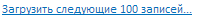

# Конструктор Hyperlink

Конструктор Hyperlink
-

# Конструктор Hyperlink

## Синтаксис

PP.Ui.Hyperlink (settings)

## Параметры

settings. JSON-объект со значениями свойств компонента.

## Описание

Конструктор Hyperlink создает экземпляр компонента [Hyperlink](../../Components/Hyperlink/Hyperlink.htm).

## Пример

Для выполнения примера в теге HEAD подключите ссылки на библиотеку PP.js и визуальные стили PP.css. Для размещения компонента добавьте на страницу элемент DIV с идентификатором «hyperlink». В теге SCRIPT добавьте код создания компонента:

        var settings = {
            Content: "Загрузить следующие 100 записей...",
            ParentNode: document.getElementById("hyperlink")
        };
        var hyperLink = new PP.Ui.Hyperlink(settings);
        hyperLink.Click.add(function (sender, args)
        {
            console.log("Переход по гиперссылке");
            console.log(sender.getContent());
        });

После выполнения примера на странице появится гиперссылка, имеющая следующий вид:

При нажатии на гиперссылку в консоль браузера будет выводиться сообщение «Переход по гиперссылке» и текст гиперссылки.

См. также:

[Hyperlink](Hyperlink.htm)

		Справочная
		 система на версию 10.9
		 от 18/08/2025,
		 © ООО «ФОРСАЙТ»,
