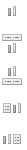
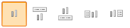

# Конструктор IconListItem

Конструктор IconListItem
-

# Конструктор IconListItem

## Синтаксис

PP.Ui.IconListItem (settings);

## Параметры

settings. JSON объект со значениями
 свойств компонента.

## Описание

Конструктор IconListItem создает
 экземпляр компонента [IconListItem](../../Components/IconListItem/IconListItem.htm).

## Пример

Для выполнения примера подключите к html-странице ссылки на библиотеку
 PP.js и таблицы визуальных стилей PP.css. Создадим [список](dhtmlList.chm::/components/listbox/listbox.htm),
 состоящий из пиктограмм. Для этого необходимо, чтобы на одном уровне с
 html-страницей, на которой будет размещен список, находился файл с наименованием
 «1.png». Данный файл содержит набор пиктограмм, который выглядит следующим
 образом:

Ссылка на этот файл и установленные размеры пиктограмм будут содержаться
 в параметрах невизуального компонента [ImageList](../../Components/ImageList/ImageList.htm).

Каждая пиктограмма будет помещаться в отдельном элементе списка - компоненте
 [IconListItem](../../Components/IconListItem/IconListItem.htm).
 Поэтому нам понадобится создать 5 экземпляров компонента [IconListItem](../../Components/IconListItem/IconListItem.htm).

После выполнения примера на html-странице будет размещен список, имеющий
 следующий вид:

Другой вариант кода для размещения этого списка представлен в описании
 свойства [ListBox.Orientation](dhtmlList.chm::/Classes/listbox/listbox.orientation.htm).

См. также:

[IconListItem](IconListItem.htm)

		Справочная
		 система на версию 10.9
		 от 18/08/2025,
		 © ООО «ФОРСАЙТ»,
