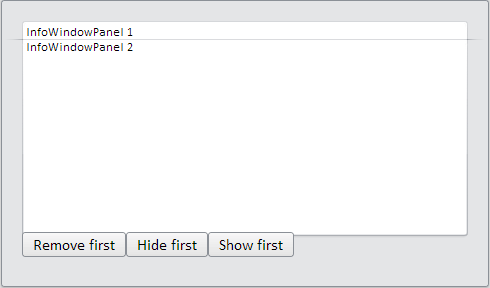

# Конструктор InfoWindow

Конструктор InfoWindow
-

# Конструктор InfoWindow

## Синтаксис

PP.Ui.InfoWindow (settings)

## Параметры

settings. JSON-объект со значениями
 свойств компонента.

## Описание

Конструктор InfoWindow создает
 экземпляр компонента [InfoWindow](../../Components/InfoWindow/InfoWindow.htm).

## Пример

Для выполнения примера подключите ссылки на файлы PP.js, PP.css, PP.Metabase.js,
 PP.Metabase.css, PP.App.js, PP.App.css. В теге BODY добавьте элемент DIV
 с идентификатором «but1». В теге SCRIPT добавим следующий код:

        var infoWindow = new PP.Ui.InfoWindow({
            Height: 300
        });
        infoWindow.setWidth(500);
        infoWindow.addPanel(new PP.Ui.InfoWindowPanel( //добавляем панели в информационное окно
            {
                Content: "InfoWindowPanel 1",
                Id: "InfoWindowPanel1"
            }));
        infoWindow.addPanel(new PP.Ui.InfoWindowPanel({
            Content: "InfoWindowPanel 2",
            Id: "InfoWindowPanel2"
        }));

        //добавляем кнопки в информационное окно
        infoWindow.addToButtonContent(new PP.Ui.Button({
            Height: 20,
            Content: "Remove first",
            Click: function () {
                infoWindow.removePanel(infoWindow.getPanels()[0]) //при нажатии на кнопку будет удалена панель с индексом 0
            }
        }));
        infoWindow.addToButtonContent(new PP.Ui.Button({
            Height: 20,

            Content: "Hide first",
            Click: function () {
                infoWindow.hidePanel(infoWindow.getPanels()[0])
            }
        }));
        infoWindow.addToButtonContent(new PP.Ui.Button(
           {
                Height: 20,
                Content: "Show first",
                Click: function () {
                    infoWindow.showPanel(infoWindow.getPanels()[0])
                }

            }));
        var btn = new PP.Ui.Button( //добавляем кнопку, при нажатии на которую в центре экрана будет отображаться информационное окно
            {
                Height: 20,
                Content: "Show info",
                ParentNode: document.getElementById("but1"),
                Click: function () {
                    infoWindow.showCenter();
                }
            });

После выполнения примера при нажатии на кнопку «Show info» в центре
 экрана отобразится информационное окно с тремя кнопками и двумя панелями:

При нажатии на кнопку «Hide first» будет скрыта первая панель (панель
 с индексом 0). При нажатии на кнопку «Show first» данная панель будет
 отображена.

При нажатии на кнопку «Remove first» будет удалена первая панель (панель
 с индексом 0).

См. также:

[InfoWindow](InfoWindow.htm)

		Справочная
		 система на версию 10.9
		 от 18/08/2025,
		 © ООО «ФОРСАЙТ»,
