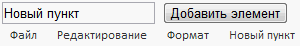

# MainMenu.addItem

MainMenu.addItem
-

# MainMenu.addItem

## Синтаксис

addItem (value)

## Параметры

value. Пункт главного меню, экземпляр класса [MainMenuButton](../MainMenuButton/MainMenuButton.htm).

## Описание

Метод addItem добавляет дочерний элемент главного меню.

## Пример

Для выполнения примера предполагается наличие на html-странице компонента [MainMenu](../../Components/MainMenu/MainMenu.htm) с наименованием «mainMenu» (см. «[Пример создания компонента MainMenu](../../Components/MainMenu/MainMenu_example.htm)»). Добавим на страницу поле ввода, в котором будет устанавливаться название пункта меню, и кнопку, при нажатии на которую в главное меню будет добавлен элемент с указанным названием:

<input type="text" id="addCont" />

<input type="button" id="addBut" value="Добавить элемент" onclick="AddItem();" />

В javascript-код должна быть добавлена следующая функция:

function AddItem() {

    var addCont = document.getElementById("addCont");

    var item = new PP.Ui.MainMenuButton();

    item.setContent(addCont.value);

    mainMenu.addItem(item);

}

После выполнения примера на html-странице будет размещено поле ввода и кнопка «Добавить элемент», при нажатии на кторрую в главное меню будет добавлен пункт с названием, установленным в поле ввода:

См. также:

[MainMenu](MainMenu.htm)

		Справочная
		 система на версию 10.9
		 от 18/08/2025,
		 © ООО «ФОРСАЙТ»,
