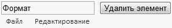

# MainMenu.removeItem

MainMenu.removeItem
-

# MainMenu.removeItem

## Синтаксис

removeItem (value, isDispose);

## Параметры

value. Кнопка главного меню, экземпляр класса [MainMenuButton](../MainMenuButton/MainMenuButton.htm), которую необходимо удалить;

isDispose. Полностью ли удалить кнопку главного меню. По умолчанию - true.

## Описание

Метод removeItem удаляет дочерний элемент главного меню

## Пример

Для выполнения примера предполагается наличие на html-странице компонента [MainMenu](../../Components/MainMenu/MainMenu.htm) с наименованием «mainMenu» (см. «[Пример создания компонента MainMenu](../../Components/MainMenu/MainMenu_example.htm)»). Добавим на страницу поле ввода, в котором будет устанавливаться название пункта меню, который необходимо удалить, и кнопку, при нажатии на которую из главного меню будет удален элемент с указанным названием:

<input type="text" id="remCont" />

<input type="button" id="remBut" value="Удалить элемент" onclick="RemoveItem();" />

В javascript-код должна быть добавлена следующая функция:

function RemoveItem() {

    var remCont = document.getElementById("remCont");

    var val = remCont.value;

    for (var i = 0; i < mainMenu._Items.length; i++)

    var item = mainMenu._Items[i];

    if (val === item.getContent())

    mainMenu.removeItem(item);

}

После выполнения примера при нажатии на кнопку «Удалить элемент» из главного меню будет удален элемент, название которого установлено в поле ввода. В данном примере доступно удаление только крайних правых кнопок главного меню:

На рисунке выше показано, как при нажатии на кнопку был удален крайний правый элемент главного меню с названием «Формат».

См. также:

[MainMenu](MainMenu.htm)

		Справочная
		 система на версию 10.9
		 от 18/08/2025,
		 © ООО «ФОРСАЙТ»,
