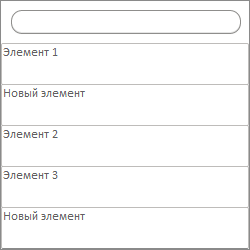
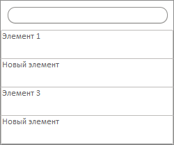

# MainPanel.removeItem

MainPanel.removeItem
-

# MainPanel.removeItem

## Синтаксис

removeItem(index: Number);

## Параметры

index. Индекс удаляемого элемента.

## Описание

Метод removeItem удаляет элемент
 из меню панели по индексу.

## Пример

Для выполнения примера необходимо наличие на html-странице ссылок на
 файлы сценариев PP.js, PP.Ext.js и файлы стилей PP.css и PP.Ext.css. Создаем
 раскрывающуюся панель с меню:

function createMainPanel() {
    // Создаем панель с меню
    mainPanel = new PP.Ui.MainPanel({
        // Добавляем элементы
        Items: [
            {
                HotKey: "Элемент 1"
            },
            {
                HotKey: "Элемент 2"
            },
            {
                HotKey: "Элемент 3"
            }
        ]
    });

    // Отображаем панель с меню
    mainPanel.show(10, 10);
}
Добавляем два новых элемента в конец меню и после первого элемента:

// Добавляем новый элемент в конец меню
mainPanel.addItem({
    HotKey: "Новый элемент"
});
// Создаем новый элемент и добавляем после первого элемента
item = new PP.Ui.MainPanelItem({
    HotKey: "Новый элемент"
});
mainPanel.insertItem(item, 1);
В результате во всплывающую панель с меню будет добавлено два новых
 элемента:

Получаем наименования первого и последнего элементов:

// Получаем наименование первого элемента
console.log("Наименование первого элемента: " + mainPanel.getItems()[0]._HotKey);
// Получаем наименование последнего элемента
console.log("Наименование последнего элемента: " + mainPanel.getItem(mainPanel.getItems().length-1)._HotKey);
В результате в консоль будет выведены наименования первого и последнего
 элементов:

Наименование первого элемента: Элемент 1

Наименование последнего элемента: Новый элемент

Удаляем третий по счету элемент из меню:

// Удаляем третий по счету элемент
mainPanel.hide();
mainPanel.removeItem(2);
mainPanel.show();
В результате из меню будет удален третий по счету элемент:

См. также:

[MainPanel](MainPanel.htm)

		Справочная
		 система на версию 10.9
		 от 18/08/2025,
		 © ООО «ФОРСАЙТ»,
