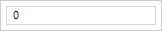
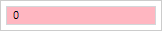

# MaskEdit.AllowedSymbols

MaskEdit.AllowedSymbols
-

# MaskEdit.AllowedSymbols

## Синтаксис

AllowedSymbols: Array

## Описание

Свойство AllowedSymbols устанавливает
 массив символов, допустимых для ввода в редактор.

## Комментарии

Значение свойства устанавливается из JSON и с помощью метода setAllowedSymbols,
 а возвращается с помощью метода getAllowedSymbols.

## Пример

Для выполнения примера необходимо наличие на html-странице ссылок на
 файл сценария PP.js и файл стилей PP.css, в теге <body> html-страницы
 элемента 
 с идентификатором «maskEdit». Создадим экземпляр
 компонента MaskEdit и добавим обработчики событий KeyPress и [ValueChanged](MaskEdit.ValueChanged.htm):

function createMaskEdit() {
        // Создаем редактор ввода
        maskEdit = new PP.Ui.MaskEdit({
            // Устанавливаем родительский элемент
            ParentNode: document.getElementById("maskEdit"),
            // Устанавливаем массив разрешенных символов
            AllowedSymbols: ["0", "1", "2", "3", "4", "5"],
            // Устанавливаем обработчик события изменения значения редактора ввода
            ValueChanged: function (sender, args) {
                console.log("Изменилось значение редактора ввода");
            }
        });
        // Устанавливаем шаг изменения значения
        maskEdit.setStep(1);
        // Устанавливаем обработчик события нажатия на клавиатуру
        maskEdit.KeyPress.add(function (sender, args) {
            // Проверяем, является ли введенный символ разрешенным
            if (contains(this._AllowedSymbols, args.Event.charCode)) {
                // После ввода разрешенного символа редактору ввода будет установлен стиль для допустимых значений
                this.applyValidCSS();
            } else {
                // После ввода неразрешенного символа редактору ввода будет установлен стиль для недопустимых значений
                this.applyNotValidCSS();
            }
        });
    }
    // Функция проверки вхождения символа в массив
function contains(arr, codeSymbol) {
    var i = 0;
    while (arr[i] != undefined) {
        if (arr[i].charCodeAt(0) == codeSymbol) {
            return true;
        }
        i++;
    }
    return false;
}
Введем символ «0» в редактор ввода. Символ будет введен, так как он
 является разрешенным, и к редактору ввода будет применен стиль для допустимых
 символов:

В консоль будет выведено сообщение об изменении значения редактора ввода:

Изменилось значение редактора ввода

Введем символ «6» в редактор ввода. Символ не будет введен, так как
 является неразрешенным, и к редактору ввода будет применен стиль для недопустимых
 символов:

 

См. также:

[MaskEdit](MaskEdit.htm)

		Справочная
		 система на версию 10.9
		 от 18/08/2025,
		 © ООО «ФОРСАЙТ»,
