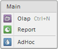

# Menu.ImageList

Menu.ImageList
-

# Menu.ImageList

## Синтаксис

ImageList: PP.[ImageList](dhtmlCommon.chm::/Classes/imagelist/imagelist.htm)

## Описание

Свойство ImageList устанавливает
 [спрайт](../../Components/ImageList/ImageList.htm) для меню.

## Комментарии

Спрайт - это набор изображений в одном графическом файле. Для того чтобы
 установить конкретное изображение из спрайта для элементов меню, нужно
 задать координаты [строки](../MenuItem/MenuItem.RowIndex.htm)
 и [столбца](../MenuItem/MenuItem.RowIndex.htm) данного изображения
 в спрайте.

## Пример

Для выполнения примера в теге HEAD подключите ссылки на библиотеку компонентов
 PP.js и табицы визуальных стилей PP.css. Далее приведен пример динамического
 создания компонента Menu, для элементов которого установлены изображения
 из спрайта «menu_icon.png«, который должен находиться в папке «img» корневого
 каталога:

<body>

</body>

После выполнения примера на html-странице будет размещена кнопка «Show
 menu», при нажатии на которую будет вызвано меню, состоящее из [заголовка](../MenuHeader/MenuHeader.htm)
 и четырех элементов (последний - [невидимый](../MenuItem/MenuItem.Visible.htm)).
 Между вторым и третьим пунктами меню установлен [разделитель](../Separator/Separator.htm).
 Для первого пункта меню задано [название
 «горячих клавиш»](../MenuItem/MenuItem.HotKey.htm) и идентификатор. Для каждого пункта меню установлено
 изображение из заданного спрайта:

См. также:

[Menu](Menu.htm)

		Справочная
		 система на версию 10.9
		 от 18/08/2025,
		 © ООО «ФОРСАЙТ»,
