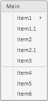

# Menu.insertItemAfter

Menu.insertItemAfter
-

# Menu.insertItemAfter

## Синтаксис

insertItemAfter (item: Object, afterItem: PP.Ui.[MenuItem](../MenuItem/MenuItem.htm))

## Параметры

item. Пункт меню, который необходимо вставить;

afterItem. Пункт меню, после которого необходимо вставить новый пункт.

## Описание

Метод insertItemAfter вставляет пункт в меню после указанного пункта.

## Пример

Для выполнения примера предполагается наличие на странице компонента [Menu](../../Components/Menu/Menu.htm) (см. «[Пример создания компонента Menu](../../Components/Menu/Menu_example.htm)»). Вставим пункты меню перед и после пункта меню с индексом 2:

menu.insertItemAfter("Item2.1", menu.getItems()[2]);

menu.insertItemBefore("Item1.1", menu.getItems()[2]);

После выполнения примера в меню будут вставлены пункты «Item1.1» и «Item2.1»:

См. также:

[Menu](Menu.htm)

		Справочная
		 система на версию 10.9
		 от 18/08/2025,
		 © ООО «ФОРСАЙТ»,
