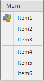

# MenuItem.ImageUrl

MenuItem.ImageUrl
-

# MenuItem.ImageUrl

## Синтаксис

ImageUrl: String

## Описание

Свойство ImageUrl устанавливает путь до изображения для элемента меню.

## Комментарии

Свойство актуально, если:

-
не задано значение для свойства [Checked](MenuItem.Checked.htm);

-
не задано значение для свойств [ColumnIndex](MenuItem.ColumnIndex.htm) и [RowIndex](MenuItem.RowIndex.htm), определяющих координаты пиктограммы в [спрайте](../../Components/ImageList/ImageList.htm);

-
свойства [Menu.ShowIcons](../Menu/Menu.ShowIcons.htm) установлено значение true.

## Пример

Для выполнения примера предполагается наличие на html-странице компонента [Menu](../../Components/Menu/Menu.htm) с дочерним элементом «item1» (см. «[Пример создания компонента Menu](../../Components/Menu/Menu_example.htm)»). В папке «img», находящейся в корневом каталоге, должно лежать изображение «icon.png». Установим это изображение для элемента меню с наименованием «item1»:

item1.setImageUrl("img/icon.png");

После выполнения примера для элемента меню с наименованием «item1» будет установлено изображение:

См. также:

[MenuItem](MenuItem.htm)

		Справочная
		 система на версию 10.9
		 от 18/08/2025,
		 © ООО «ФОРСАЙТ»,
