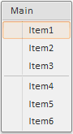

# MenuItem.IsHovered

MenuItem.IsHovered
-

# MenuItem.IsHovered

## Синтаксис

IsHovered: Boolean

## Описание

Свойство IsHovered определяет, отображается ли пункт меню как при наведении на него курсора.

## Комментарии

Если для свойства установлено значение true, то пункт меню отображается как при наведении на него курсора. По умолчанию установлено значение false.

## Пример

Для выполнения примера предполагается наличие на html-странице компонента [Menu](../../Components/Menu/Menu.htm) с дочерним элементом «item1» (см. «[Пример создания компонента Menu](../../Components/Menu/Menu_example.htm)»). Изменим отображение данного элемента:

item1.setIsHovered(true);

После выполнения примера компонент [Menu](../../Components/Menu/Menu.htm) будет выглядеть следующим образом:

См. также:

[MenuItem](MenuItem.htm)

		Справочная
		 система на версию 10.9
		 от 18/08/2025,
		 © ООО «ФОРСАЙТ»,
