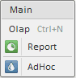

# MenuItem.setShowIcon

MenuItem.setShowIcon
-

# MenuItem.setShowIcon

## Синтаксис

setShowIcon (value);

## Параметры

value. Определяет, скрыто ли изображение. Если установлено значение false, изображение скрыто. По умолчанию установлено true

## Описание

Метод setShowIcon определяет, отображается ли пиктограмма для пункта меню

## Комментарии

Установить признак отображения пиктограммы для всех пунктов меню можно при помощи свойства [Menu.ShowIcons](../Menu/Menu.ShowIcons.htm).

## Пример

Для выполнения примера предполагается наличие на html-странице компонента [Menu](../../Components/Menu/Menu.htm) с наименованием «menu1», в состав которого входят несколько дочерних элементов, для каждого из которых установлено изображение (см. пример для свойства [ImageList](../Menu/Menu.ImageList.htm)). Скроем изображение первого (после заголовка) пункта меню:

menu1.getItems()[1].setShowIcon(false);

После выполнения примера изображение первого пункта меню будет скрыто:

См. также:

[MenuItem](MenuItem.htm)

		Справочная
		 система на версию 10.9
		 от 18/08/2025,
		 © ООО «ФОРСАЙТ»,
