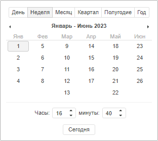

# MonthCalendar.Mode

MonthCalendar.Mode
-

# MonthCalendar.Mode

## Синтаксис

Mode: [PP.MonthCalendarMode](../../Enums/MonthCalendarMode.htm)

## Описание

Свойство Mode устанавливает
 режим отображения календаря.

## Комментарии

Значениями свойства являются элементы перечисления PP.MonthCalendar.Mode.

По умолчанию установлено значение 0, то есть календарь отображается
 в режиме дней.

## Пример

Для выполнения примера создайте компонент [MonthCalendar](../../Components/MonthCalendar/MonthCalendar.htm)
 (см.«[Пример
 создания компонента MonthCalendar](../../Components/MonthCalendar/Example_MonthCalendar.htm)»). В свойствах компонента задайте
 режим отображения календаря:

Mode: 1

После выполнения примера будет отображен календарь в режиме недель:

См. также:

[MonthCalendar](MonthCalendar.htm)

		Справочная
		 система на версию 10.9
		 от 18/08/2025,
		 © ООО «ФОРСАЙТ»,
