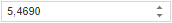

# NumberEdit.Value

NumberEdit.Value
-

# NumberEdit.Value

## Синтаксис

Value: Number;

## Описание

Свойство Value устанавливает
 числовое значение компонента.

## Комментарии

Значение свойства задается в конструкторе [NumberEdit](Constructor_NumberEdit.htm)
 или с помощью метода setValue,
 а возвращается с помощью метода getValue.

Если значение для свойства не установлено, в окне редактора будет установлено
 значение 0. Если значение 0 не входит в диапазон от [минимального](NumberEdit.MinValue.htm)
 до [максимального](NumberEdit.MaxValue.htm) значения, то в
 строке ввода будет установлено ближайшее валидное значение. При потере
 фокуса компонентом будет установлено минимальное допустимое значение.

Если значение содержит несколько знаков после запятой, то при использовании
 метода getValue число округляется
 в зависимости от заданного значения свойства [NumberEdit.FractionCount](NumberEdit.FractionCount.htm).
 Для получения заданного числа без округления используйте метод [NumberEdit.getUnroundValue](NumberEdit.getUnroundValue.htm).

## Пример

Перед выполнением примера ознакомьтесь с [рекомендациями](dhtml.chm::/specification/JavaScript_main.htm)
 к написанию кода.

Для создания числового редактора значений используйте HTML-код:

<!DOCTYPE html PUBLIC "-//W3C//DTD XHTML 1.0 Transitional//EN" "http://www.w3.org/TR/xhtml1/DTD/xhtml1-transitional.dtd">
<html>
<head>
    <meta http-equiv="X-UA-Compatible" content="IE=edge" />
    <title>NumberEdit</title>
    
    <link href="../build/PP.css" rel="stylesheet" type="text/css" />

    
</head>
<body onload="Ready()">
    

</body>
</html>

После выполнения примера на html-странице будет размещен числовой редактор
 с установленным значением:

В консоль будет выведено округленное и неокругленное значение компонента:

5.469

5.468953

См. также:

[NumberEdit](NumberEdit.htm)

		Справочная
		 система на версию 10.9
		 от 18/08/2025,
		 © ООО «ФОРСАЙТ»,
