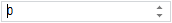
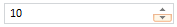
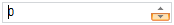

# NumberEdit.Walkthrough

NumberEdit.Walkthrough
-

# NumberEdit.Walkthrough

## Синтаксис

Walkthrough: Boolean

## Описание

Свойство Walkthrough определяет, является ли прокрутка значения цикличной.

## Комментарии

Если для свойства установлено значение true, то прокрутка является цикличной, то есть прокрутка осуществляется от минимального к максимальному значению и наоборот.

Сравните:

Для свойства Walkthrough установлено значение true ([MaxValue](NumberEdit.MaxValue.htm) = 10, [MinValue](NumberEdit.MinValue.htm) = 0):

В поле ввода - минимальное значение.

При нажатии на клавишу DOWN или на нижнюю кнопку прокрутки в поле ввода будет установлено максимальное значение:

Для свойства Walkthrough установлено значение false ([MaxValue](NumberEdit.MaxValue.htm) = 10, [MinValue](NumberEdit.MinValue.htm) = 0):

При нажатии на клавишу DOWN или на нижнюю кнопку прокрутки значение в поле ввода не изменится.

По умолчанию установлено значение false.

## Пример

Пример использования свойства приведен на странице «[Пример создания компонента NumberEdit](../../Components/NumberEdit/Example_NumberEdit.htm)».

См. также:

[NumberEdit](NumberEdit.htm)

		Справочная
		 система на версию 10.9
		 от 18/08/2025,
		 © ООО «ФОРСАЙТ»,
