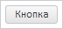

# PP.Ui.animate

PP.Ui.animate
-

# PP.Ui.animate

## Синтаксис

PP.Ui.animate(obj: HTMLElement | PP.[Object](dhtmlCommon.chm::/Classes/object/object.htm),
 type: PP.Ui.AnimationType, propName: String, settings: Object, callback:
 PP.Delegate | Function);

## Параметры

obj. Анимируемый
 объект или вершина;

type. Тип
 анимации. Значение аргумента - элемент перечисления PP.Ui.AnimationType;

propName. Анимируемое
 свойство объекта;

settings. Настройки
 анимации;

callback. Функция
 обратного вызова, которая выполняется после завершения анимации.

## Описание

Метод animate запускает анимацию
 объекта.

## Пример

Для выполнения примера необходимо наличие на html-странице ссылок на
 файлы сценария PP.js и файл стилей PP.css, в теге <body> html-страницы
 элемента 
 с идентификатором «button». В событии onload тега
 <body> необходимо указать вызов функции createButton(). Добавляем
 кнопку на страницу:

var button;
function createButton() {
    // Создаем кнопку
    button = new PP.Ui.Button({
        // Устанавливаем родительский элемент
        ParentNode: document.getElementById("button"),
        // Устанавливаем содержимое кнопки
        Content: "Кнопка",
    });
    // Запускаем анимацию
    PP.Ui.animate(button.getDomNode(), "CSS", "width", {
        Start: 10,
        End: 60,
        Duration: 4000
    });
}
Запускаем анимацию изменения ширины кнопки от значения 10 до значения
 60 в течение 5 секунд:

// Запускаем анимацию
PP.Ui.animate(button.getDomNode(), "CSS", "width", {
    Start: 10,
    End: 60,
    Duration: 4000
});
Начальное состояние кнопки:

Состояние кнопки после завершения анимации:

См. также:

[PP.Ui](../Classes.htm)

		Справочная
		 система на версию 10.9
		 от 18/08/2025,
		 © ООО «ФОРСАЙТ»,
