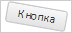

# PP.Ui.rotateNode

PP.Ui.rotateNode
-

# PP.Ui.rotateNode

## Синтаксис

PP.Ui.rotateNode(node: HTMLElement, angle: Number);

## Параметры

node. HTML-элемент;

angle.
 Значение угла поворота (в градусах).

## Описание

Метод rotateNode разворачивает
 HTML-элемент на заданный угол.

## Пример

Для выполнения примера необходимо наличие на html-странице
 ссылок на файлы сценария PP.js и файл стилей PP.css, в теге <body>
 html-страницы элемента 
 с идентификатором «button». В событии onload тега <body>
 необходимо указать вызов функции createButton(). Добавляем кнопку на страницу
 и разоврачиваем ее на 15 градусов:

var button;
function createButton() {
    // Создаем кнопку
    button = new PP.Ui.Button({
        // Устанавливаем родительский элемент
        ParentNode: document.getElementById("button"),
        // Устанавливаем содержимое кнопки
       Content: "Кнопка",
    });
}
// Разворачиваем кнопку на 10 градусов
PP.Ui.rotateNode(button.getDomNode(), 10);
В результате кнопка будет повернута на 10 градусов:

См. также:

[PP.Ui](../Classes.htm)

		Справочная
		 система на версию 10.9
		 от 18/08/2025,
		 © ООО «ФОРСАЙТ»,
