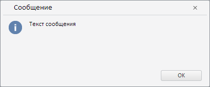

# PP.Ui.showMessage

PP.Ui.showMessage
-

# PP.Ui.showMessage

## Синтаксис

PP.Ui.showMessage(text: String, type: PP.Ui.[MessageType](../../Enums/MessageType.htm),
 imagePath: String);

## Параметры

text. Текст
 окна;

type.
 Элемент перечисления PP.Ui.[MessageType](../../Enums/MessageType.htm),
 определяющий тип окна;

imagePath.
 Путь к папке, в которой находятся пиктограммы.

## Описание

Метод showMessage создает
 и показывает окно.

## Пример

Для выполнения примера необходимо наличие ссылки на файл сценария PP.js,
 файл с настройками (например resources.ru.js) и файл с пиктограммами.
 Выводим информационное окно на экран:

// Устанавливаем путь к ресурсам
PP.resourceManager.setRootResourcesFolder("../build/resources/");
// Устанавливаем культуру
PP.setCurrentCulture(PP.Cultures.ru);
// Выводим информационное окно
PP.Ui.showMessage("Текст сообщения", PP.Ui.MessageType.Information, "../build/img/");
В результате на экране появится окно:

См. также:

[PP.Ui](../Classes.htm)

		Справочная
		 система на версию 10.9
		 от 18/08/2025,
		 © ООО «ФОРСАЙТ»,
