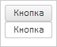

# PP.Ui.toImage

PP.Ui.toImage
-

# PP.Ui.toImage

## Синтаксис

PP.Ui.toImage(element: PP.Ui.[Control](../Control/Control.htm),
 callback: PP.Delegate | Function, bounds: PP.Rect);

## Параметры

element. Элемент
 управления элемента;

callback. Функция
 обратного вызова, которая выполняется после отрисовки изображения. Аргумент
 Canvas - область с картинкой;

bounds.
 Границы области, которую надо отрисовать.

## Описание

Метод toImage делает снимок
 области элемента.

## Пример

Для выполнения примера необходимо наличие на html-странице
 ссылок на файлы сценария PP.js, PP.Util.js и файл стилей PP.css, в теге
 <body> html-страницы элемента 
 с идентификатором «button». В событии onload
 тега <body> необходимо указать вызов функции createButton(). Добавляем
 кнопку на страницу:

var button;
function createButton() {
    // Создаем кнопку
    button = new PP.Ui.Button({
        // Устанавливаем родительский элемент
        ParentNode: document.getElementById("button"),
        // Устанавливаем содержимое кнопки
        Content: "Кнопка",
    });
Отобразим снимок кнопки под элементом кнопки:

var domNode = button.getDomNode();
// Получаем элемент управления кнопки
var ctrlButton = PP.Ui.getCtrlById(domNode.id);
// Получаем снимок кнопки и выводим его под кнопкой
PP.Ui.toImage(ctrlButton, function (sender, args) { domNode.insertAdjacentElement("afterEnd", args.Canvas) });
В результате под кнопкой будет отображен ее снимок:

См. также:

[PP.Ui](../Classes.htm)

		Справочная
		 система на версию 10.9
		 от 18/08/2025,
		 © ООО «ФОРСАЙТ»,
