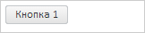
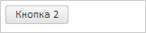

# Panel.toFront

Panel.toFront
-

# Panel.toFront

## Синтаксис

toFront(ctrl: PP.Ui.[Control](../Control/Control.htm));

## Параметры

ctrl. Элемент, перемещаемый
 на передний план.

## Описание

Метод toFront перемещает элемент
 на передний план.

## Пример

Для выполнения примера необходимо наличие на html-странице ссылок на
 файл сценария PP.js и файл стилей PP.css, в теге <body> html-документа
 элемента 
 с идентификатором «panel», а сам пример нужно разместить
 в теге <script>. Добавим в документ панель с двумя кнопками:

function createPanel() {
    // Создам панель
    panel = new PP.Ui.Panel({
        // Устанавливаем родительский элемент
        ParentNode: document.getElementById("panel"),
        // Устанавливаем наименование панели
        Name: "Panel",
        // Устанавливаем пользовательское позиционирование элементов
        IsAbsolutePositioning: false
    });
    // Создаем кнопки
    button1 = new PP.Ui.Button({
        Content: "Кнопка 1"
    });
    button2 = new PP.Ui.Button({
        Content: "Кнопка 2"
    });
    // Добавляем кнопки в панель
    panel.beginUpdate();
    panel.add(button1);
    panel.add(button2);
    panel.endUpdate();
}
В результате в документ будет добавлена панель с двумя кнопками:

Проверяем возможность использования [Anchors](../Control/Control.Anchors.htm):

// Проверяем возможность использования Anchors
if (panel.supportAnchors()) {
    console.log("Возможно использование Anchors");
} else {
    console.log("Anchors использовать нельзя");
}
В результате в консоль будет выведена информация о возможности использования
 [Anchors](../Control/Control.Anchors.htm):

Anchors использовать нельзя

Получаем размеры панели:

// Получаем размеры панели
console.log("Высота панели: " + panel.getContentNode().clientHeight);
console.log("Ширина панели: " + panel.getContentNode().clientWidth);
В результате в консоль будут выведены размеры панели:

Высота панели: 21

Ширина панели: 150

Получаем содержимое элемента, который находится в координатах (10, 10):

// Получаем содержимое элемента, который находится по координатам (10, 10)
if (panel.getItemByPoint(10, 10) !== undefined) {
    console.log("Содержимое элемента: " + panel.getItemByPoint(10, 10).getContent());
} else {
    console.log("Элемент отсутствует");
}
В результате в консоль будет выведено содержимое элемента или информация
 о его отсутствии:

Содержимое элемента: Кнопка 1

Устанавливаем абсолютное позиционирование элементов панели и перемещаем
 первую кнопку на передний план:

// Устанавливаем абсолютное позиционирование элементов
panel.setIsAbsolutePositioning(true);
// Перемещаем 1 кнопку на передний план
panel.toFront(button1);
В результате первая кнопка будет на переднем плане, а вторая на заднем:

Перемещаем первую кнопку на задний план:

panel.toBack(button1);
В результате первакя кнопка будет на заднем плане, а вторая на переднем:

См. также:

[Panel](Panel.htm)

		Справочная
		 система на версию 10.9
		 от 18/08/2025,
		 © ООО «ФОРСАЙТ»,
