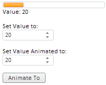

# ProgressBar.ValueChanged

ProgressBar.ValueChanged
-

# ProgressBar.ValueChanged

## Синтаксис

ValueChanged: function (sender,args)

## Параметры

sender. Источник события;

args. Информация о событии.

## Описание

Событие ValueChanged наступает
 при изменении значения компонента.

## Пример

Для выполнения в теге HEAD добавьте ссылки на библиотеку компонентов
 PP.js и визуальные стили PP.css. В теге BODY добавьте следующие элементы:

 
Set Value to:

 
Set Value Animated to:

 

Minimal Value Is Reached

Maximal Value Is Reached

В теге SCRIPT добавьте следующий код:

	//Компонент ProgressBar
	var PB = new PP.Ui.ProgressBar(
	{
	    ParentNode: document.getElementById("example"),
	    Width: 200,
	    //начальное значение компонента
	    Value: 20,
	    //событие изменения значения компонента
	    ValueChanged: function ()
	    {
	        //при изменении значения компонента для DOM-вершины с идентификатором «value» будет установлено содержимое «Value: <текущее значение>»
	        document.getElementById("value").innerHTML = "Value: " + this.getValue();
	        //содержимое DOM-вершин с идентификаторами «Minvalue» и «Maxvalue»
	        document.getElementById("Minvalue").style.display = "none";
	        document.getElementById("Maxvalue").style.display = "none";
	    },
	    //при достижении максимального значения (100) будет отображаться содержимое DOM-вершины с идентификатором «Maxvalue»
	    MaxValueReached: function ()
	    {
	        document.getElementById("Maxvalue").style.display = "block"
	    },
	    //при достижении минимального значения (0) будет отображаться содержимое DOM-вершины с идентификатором «Minvalue»
	    MinValueReached: function ()
	    {
	        document.getElementById("Minvalue").style.display = "block"
	    }
	});
	//числовой редактор для установки значения компонента
	var valueMeter = new PP.Ui.NumberEdit(
	{
	    ParentNode: document.getElementById("valuer"),
                Width: 100,
	    Value: 20,
	    MinValue: 0,
	    MaxValue: 1000,
	    AfterChange: function ()
	    {
	        PB.setValue(this.getValue());
	    }
	});
	//числовой редактор для установки значения, переход к которому будет осуществляться при помощи анимации
	var animValuer = new PP.Ui.NumberEdit(
	{
	    ParentNode: document.getElementById("animValuer"),
                Width: 100,
	    Value: 20,
	    MinValue: 0,
	    MaxValue: 1000
	});
	//кнопка для анимированного изменения значения
	var but = new PP.Ui.Button(
	{
	    ParentNode: document.getElementById("button"),
	    Click: function ()
	    {
	        PB.setValueAnimated(animValuer.getValue());
	        valueMeter.setValue(animValuer.getValue())
	    },
	    Content: "Animate To"
	});
После выполнения примера на странице будут размещены следующие элементы:

При изменении значения в числовом редакторе «Set Value to:» будет изменяться
 длина оранжевой полоски компонента ProgressBar
 и будет изменяться значение в строке «Value:».

При установке значения в числовом редакторе «Set Value Animated to:»
 и нажатии кнопки «Animate To» будет осуществлено анимированное изменение
 значения [ProgressBar](../../Components/ProgressBar/ProgressBar.htm),
 в  числовом редакторе «Set Value to: » и в строке «Value:» будет
 установлено текущее значение.

При установке значения 100 для компонента [ProgressBar](../../Components/ProgressBar/ProgressBar.htm)
 появится строка:

Maximal Value Is Reached

При установке значения
 0 для компонента [ProgressBar](../../Components/ProgressBar/ProgressBar.htm)
 появится строка:

Minimal Value Is Reached

См. также:

[ProgressBar](ProgressBar.htm)

		Справочная
		 система на версию 10.9
		 от 18/08/2025,
		 © ООО «ФОРСАЙТ»,
