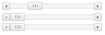
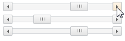

# ScrollBar.ScrollButtonMouseUp

ScrollBar.ScrollButtonMouseUp
-

# ScrollBar.ScrollButtonMouseUp

## Синтаксис

ScrollButtonMouseUp : function (sender,args)

## Параметры

sender. Источник события;

args. Информация
 о событии;

## Описание

Событие ScrollButtonMouseUp
 наступает при отжатии кнопки мыши, после нажатия кнопки перемещения ползунка
 по полосе прокрутки.

## Пример

Для выполнения примера подключим ссылки на библиотеку PP.js и таблицы
 визуальных стилей PP.css. Создадим три одинаковые полосы прокрутки с наименованиями
 «hScrollBar», «vScrollBar» и «zScrollBar». Добавим обработчики событий
 ScrollButtonMouseUp и ScrollButtonMouseDown
 для полосы прокрутки с наименованием «hScrollBar»:

    

    

    

    
После выполнения примера на html-странице будут размещены 3 экземпляра
 компонента [ScrollBar](../../Components/ScrollBar/ScrollBar.htm).
 При нажатии кнопки передвижения ползунка компонента с наименованием «hScrollBar»
 ползунки второго и третьего компонента займут позиции начала и конца пути
 первого ползунка .

До нажатия на кнопку:

После нажатия на кнопку:

См. также:

[ScrollBar](ScrollBar.htm)

		Справочная
		 система на версию 10.9
		 от 18/08/2025,
		 © ООО «ФОРСАЙТ»,
