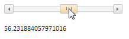

# ScrollBar.getIsMoved

ScrollBar.getIsMoved
-

# ScrollBar.getIsMoved

## Синтаксис

getIsMoved ();

## Описание

Метод getIsMoved определяет
 признак передвижения ползунка по полосе прокрутки.

## Комментарии

Метод getIsMoved возвращает
 true, если ползунок находится
 в движении. Если ползунок стоит на месте, возвращает false.

## Пример

Для выполнения примера подключите ссылки на библиотеку PP.js и таблицы
 визуальных стилей PP.css. Создадим полосу прокрутки с наименованием «hScrollBar».
 Добавим обработчик события MoveScroll
 для полосы прокрутки:

    

    

    
После выполнения примера на html-странице будет размещен экземпляр компонента
 [ScrollBar](../../Components/ScrollBar/ScrollBar.htm). При
 передвижении бегунка мышью в заголовке будет отображена текущая позиция
 ползунка.

См. также:

[ScrollBar](ScrollBar.htm)

		Справочная
		 система на версию 10.9
		 от 18/08/2025,
		 © ООО «ФОРСАЙТ»,
