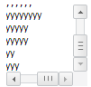

# ScrollBox.getHorisontalScrollPosition

ScrollBox.getHorisontalScrollPosition
-

# ScrollBox.getHorisontalScrollPosition

## Синтаксис

getHorisontalScrollPosition ();

## Описание

Метод getHorisontalScrollPosition возвращает позицию бегунка горизонтальной полосы прокрутки.

## Пример

Для выполнения примера в теге HEAD должны быть добавлены ссылки на библиотеку PP.js и таблицы визуальных стилей PP.css. Добавим на html-страницу область с полосами прокрутки, осуществим прокрутку по горизонтали и вертикали на количество пикселей, соответствующее половине ширины горизонтальной и высоты вертикальной полос прокрутки. В консоль выведем позиции бегунков полос прокрутки:

<body>

    
</body>

После выполнения примера на странице будет размещен компонент [ScrollBox](../../Components/ScrollBox/ScrollBox.htm), имеющий следующий вид:

В консоль браузера будет выведено:

Позиция по горизонтали: 61, позиция по вертикали: 52

См. также:

[ScrollBox](ScrollBox.htm)

		Справочная
		 система на версию 10.9
		 от 18/08/2025,
		 © ООО «ФОРСАЙТ»,
